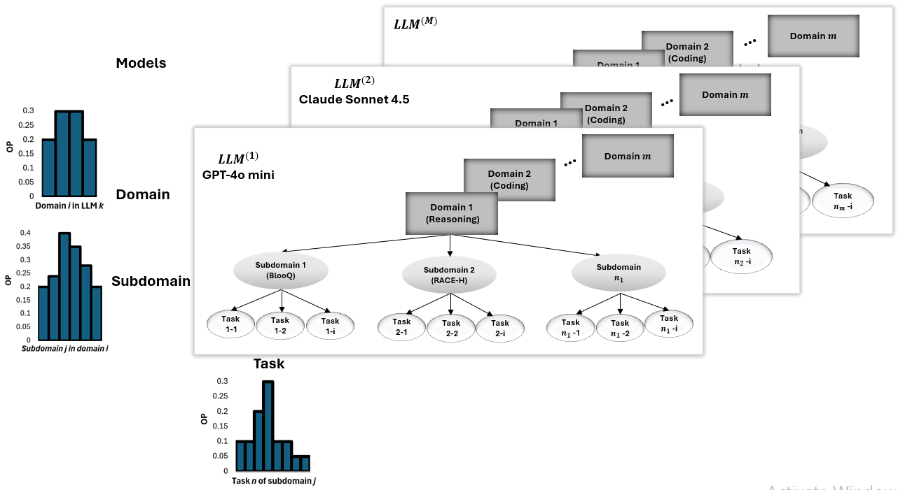

# HIP-LLM

[](https://github.com/koo-ec/HIP_LLM/actions/workflows/ci.yml)
[](https://pypi.org/project/HIPLLM/)
[](https://hipllm.readthedocs.io/en/latest/)
[](LICENSE)
[](pyproject.toml)
[](https://doi.org/10.1016/j.ress.2026.112615)

A tested implementation and replication package for:

> R. Aghazadeh-Chakherlou, Q. Guo, S. Khastgir, P. Popov, X. Zhang and X. Zhao,<br>
> **“A hierarchical imprecise probability approach to reliability assessment of large language models”**,<br>
> *Reliability Engineering & System Safety* **272** (2026), 112615.

HIP-LLM models large-language-model reliability using hierarchical Bayesian inference, imprecise priors and explicit operational profiles. This repository includes the reusable Python implementation, tests, source-provenance records, generated notebooks and reproducible result artefacts.

<p align="center">
  
</p>

## Scope and reproducibility

The package reproduces the disclosed statistical inference from published measurements. It is not an exact historical replay of the original API experiments because model snapshots, prompts, generation settings, item subsets and random seeds were not published.

Source discrepancies and reconstruction assumptions are recorded in [`data/provenance_manifest.yaml`](data/provenance_manifest.yaml) and discussed in [`results/reproduction_report.md`](results/reproduction_report.md). The implementation does not silently substitute missing source information.

## Operational-profile probability of failure

An operational-profile estimate needs two inputs:

1. binary correctness observations from a labelled evaluation set; and
2. an explicit probability distribution describing how frequently each workload stratum occurs in the intended application.

```python
from HIPLLM import OperationalFailureProb, quick_inference_settings

# 1 = correct answer, 0 = failed answer.
outcomes = [1, 1, 0, 1, 0, 0, 1, 0]
strata = ["short"] * 4 + ["long"] * 4

# Target workload: 30% short questions and 70% long questions.
operational_profile = {"short": 0.30, "long": 0.70}

estimator = OperationalFailureProb(
    profile=operational_profile,
    settings=quick_inference_settings(samples=1500, configurations=48),
)
result = estimator.fit(outcomes=outcomes, strata=strata)

print(result.summary())
result.to_df()
```

The result reports the direct operational-profile-weighted error estimate and lower/upper posterior bounds across the admissible imprecise-prior configurations. The operational profile is required and is never inferred silently.

### StrategyQA + OpenAI Colab

The runnable notebook loads the labelled StrategyQA development split from the official repository, sends a deterministic yes/no prompt to a pinned OpenAI model snapshot, records correctness, defines a decomposition-length operational profile, and estimates operational failure probability:

[](https://colab.research.google.com/github/koo-ec/HIP_LLM/blob/main/notebooks/strategyqa_openai_operational_profile_colab.ipynb)

The notebook expects `OPENAI_API_KEY` to be present in the Colab environment and caches predictions so interrupted evaluations can resume.

## Token-confidence diagnostic — a separate quantity

`FailureProb` is retained for LangChain-compatible token-logprob analysis:

```python
from langchain_google_vertexai import ChatVertexAI
from HIPLLM import FailureProb

prompts = ["What is the capital of France?", "Explain why the sky appears blue."]
llm = ChatVertexAI(model="gemini-2.5-pro")
scorer = FailureProb(llm=llm, scorers=["min_probability"])

scores = await scorer.generate_and_score(prompts=prompts)
scores.to_df()
```

Here, `failure_probability = 1 - token_confidence`. It does **not** use an operational profile and is not a calibrated factual-error probability unless it is validated and calibrated against labelled target-task data. Use `OperationalFailureProb` for the HIP-LLM operational-profile calculation.

Install the optional Vertex AI integration with:

```bash
pip install "HIPLLM[vertex]"
```

## Reproducible development with uv

### Requirements

- Python 3.10 or later
- Git and [uv](https://docs.astral.sh/uv/)

### Installation

```bash
git clone https://github.com/koo-ec/HIP_LLM.git
cd HIP_LLM
uv sync --frozen --extra test --extra profile
```

Run the safe test suite, source compilation and linter:

```bash
uv run python -m compileall -q src
uv run pytest -m "not live and not slow and not notebook"
uv run ruff check src tests scripts
```

`uv.lock` is the authoritative development lock file. The historical `requirements-lock.txt` and Conda environment remain available for replication workflows.

A Conda environment is also available:

```bash
conda env create -f environment.yml
```

## Run the replication

Published-numerics mode requires no API keys or network calls:

```bash
python scripts/run_notebook.py --mode published_numerics --scalability-profile quick
```

Run the complete reproducibility pipeline:

```bash
bash scripts/reproduce_all.sh
```

Run the test suite without live, slow or notebook tests:

```bash
python -m pytest -m "not live and not slow and not notebook"
```

Strict-exact mode stops when a required source setting is unresolved:

```bash
python scripts/run_notebook.py --strict-exact
```

> [!CAUTION]
> The paper-replication pipeline's `configs/live_api.yaml` remains a design specification for a paid-provider benchmark. Never commit API keys or cached provider responses.

## Repository layout

```text
HIP_LLM/
├── src/HIPLLM/                    high-level user API
├── src/hip_llm/                   statistical inference implementation
├── tests/                         unit and reproducibility tests
├── configs/                       published, scalability and optional live modes
├── data/                          reference data and provenance manifest
├── notebooks/                     runnable evaluation notebooks
├── scripts/                       notebook, test and provenance tooling
├── results/                       generated figures, tables and report
├── docs/figures/                  paper and explanatory image assets
├── HIP_LLM_exact_replication.ipynb
└── pyproject.toml
```

## Documentation and results

- [Quick start](docs/source/quickstart.md)
- [Paper-oriented overview and visualisations](docs/paper-overview.md)
- [Replication report](results/reproduction_report.md)
- [Generated figures](results/figures/)
- [Generated tables](results/tables/)
- [Data provenance](data/provenance_manifest.yaml)
- [Repository documentation index](docs/README.md)
- [Read the Docs source](docs/source/index.rst)

## Contributing

Contributions are welcome. Read [`CONTRIBUTING.md`](CONTRIBUTING.md), follow the [`CODE_OF_CONDUCT.md`](CODE_OF_CONDUCT.md), and use the issue or pull-request templates. Please report security concerns according to [`SECURITY.md`](SECURITY.md), not in a public issue.

## Citation

Citation metadata is provided in [`CITATION.cff`](CITATION.cff). A BibTeX entry is also available in the [paper overview](docs/paper-overview.md#-citation).

## Licence

The software and repository documentation are available under the [MIT Licence](LICENSE). Third-party publications and datasets retain their respective rights and licences.
